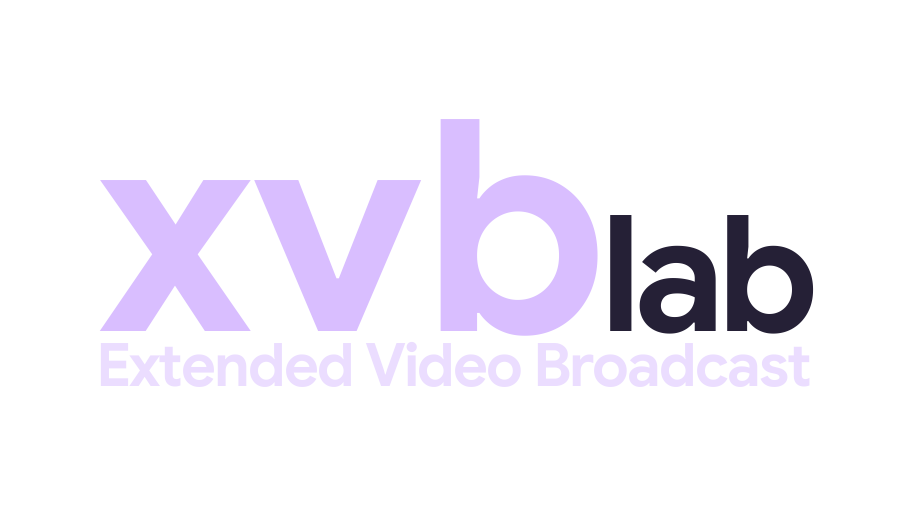

  

  <a href="https://xvb-app.pages.dev/index.html">Home</a> &nbsp;·&nbsp;
  <a href="https://xvb-app.pages.dev/">Open App</a> &nbsp;·&nbsp;
  <a href="https://xvb-app.pages.dev/doc.html">Doc</a>

  

## Legal

XVB3 is a neutral playback interface. It does not provide, host or distribute any media content, channels, credentials or IPTV subscriptions. Use it only with playlists and streams you are authorised to access. The authors accept no responsibility for how the software is used.

---

## License

MIT — see [LICENCE](LICENCE) for details.

---

## Social

<meta name="fediverse:creator" content="@xvb@mastodon.uno">
<a rel="me" href="https://mastodon.uno/@xvb">Mastodon</a>
