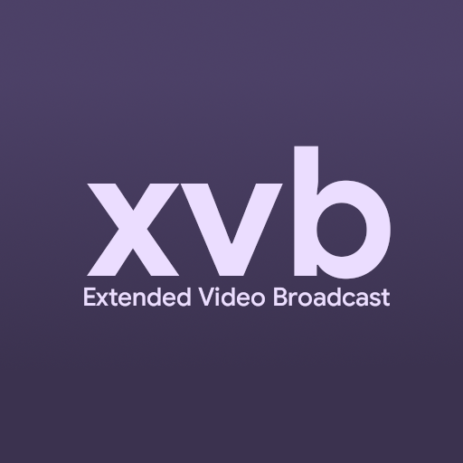
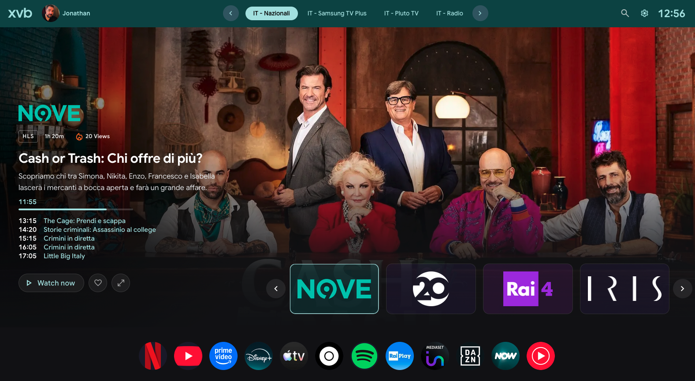

<p align="center">
  
</p>
 
<h1 align="center">XVB3</h1>
<p align="center">Extended Video Broadcast — Version 3</p>
<p align="center">
  <a href="https://xvb-app.pages.dev/">Live App</a> &nbsp;·&nbsp;
  <a href="https://xvb-app.pages.dev/settings.html">Settings</a> &nbsp;·&nbsp;
  MIT License
</p>

<br>

<p align="center">
  
</p>

---

## Overview

XVB3 is a browser-based IPTV player built around a Material You design system, a real EPG integration, multi-engine playback and dedicated desktop and mobile interfaces. It is designed to work as a full live TV browsing experience rather than a basic playlist viewer.

The application loads M3U playlists, matches channels against XMLTV programme guides, extracts dominant colors from channel logos to generate dynamic tonal palettes, and presents everything through a Google TV-inspired UI that adapts to each channel's visual identity.

---

## Features

### Interface
- Material You dynamic color system — dominant color extracted from each channel logo at runtime, used to generate a full tonal palette applied across the hero panel, surfaces and accent elements
- Hero panel with EPG programme title, description, animated progress bar, next programme stack, content rating badge, release year and duration
- Horizontal scrollable channel rows grouped by category with skeleton shimmer loading states and color-tinted card backgrounds
- Category navigation bar with smooth scrolling and arrow controls
- Real-time search across all loaded channels
- Favourites system — saved channels appear as a persistent pinned category
- Profile support with custom name and avatar stored in localStorage

### Player
- Four playback engines selected automatically by stream type: hls.js (HLS), dash.js (DASH), mpegts.js (MPEG-TS), native HTML5
- Shaka Player as ClearKey DRM fallback
- ClearKey DRM support via `license-details="kid:key"` in the M3U EXTINF line
- Iframe embed mode for streams that require a web player context
- Playback speed control, volume boost up to 200%, quality level selector
- Previous and next channel navigation from the player overlay
- Auto-hiding controls with inactivity timeout
- Browser-based local recording with live REC badge and timer
- Dynamic radial gradient background derived from the active channel's logo color

### EPG
- Multiple XMLTV sources loaded in parallel with Promise.allSettled
- Supports plain XML and gzip-compressed feeds with browser-side decompression via DecompressionStream
- Normalized channel key matching using tvg-id and display name with accent and punctuation stripping
- Programme data includes title, description, icon, content rating, release year and duration
- UI refresh every 15 seconds, full EPG re-fetch every 15 minutes
- EPG status panel in Settings showing per-source commit SHA, last update date and reachability

### Mobile
- Separate mobile interface routed automatically based on screen width at load time
- YouTube-style vertical card feed with 16:9 EPG thumbnail when available, falling back to channel logo
- Programme time slot displayed as a timestamp overlay on each card
- Inline search always visible in the top bar
- Draggable category chips
- Dynamic color applied to channel name in card detail row
- Tap to open full-screen player immediately
- iOS Safari fullscreen support via `webkitEnterFullscreen` on the video element

### Playlists and Settings
- Playlist Manager with support for remote URLs and local M3U file upload
- Built-in server playlists downloadable from the XVB server
- Multiple EPG URL slots with per-source status indicators
- BroadcastChannel sync between settings page and player for live playlist updates
- Live log console for stream and EPG debug output

---

## File Structure

```
xvb-app/
├── index.html          # Device detection redirect (desktop / mobile)
├── desktop.html        # Desktop application shell
├── mobile.html         # Mobile application shell
├── settings.html       # Settings panel (shared, responsive)
├── welcome.html        # First-run onboarding screen
├── maintenance.html    # Maintenance page
├── js/
│   ├── app.js          # Main application logic, rendering, UI
│   ├── player.js       # Playback engine selection and control
│   ├── epg.js          # XMLTV fetch, parsing and query
│   ├── playlist.js     # M3U fetch and parsing
│   ├── quality.js      # Quality badge and level selector
│   ├── state.js        # Shared application state
│   └── config.js       # URLs, timeouts and constants
├── css/
│   ├── style.css       # Desktop styles
│   └── mobile.css      # Mobile styles
└── assets/             # Logos and static assets
```

**EPG** — managed separately in [xvb-lab/xvb-epg](https://github.com/xvb-lab/xvb-epg), auto-updated every 6 hours via GitHub Actions.

**Playlists** — hosted on Cloudflare R2, managed independently.

---

## Playlist Format

XVB3 follows the standard M3U EXTINF format with one additional attribute for ClearKey DRM streams.

```
#EXTM3U

#EXTINF:-1 tvg-id="channel.id" tvg-name="Channel Name" tvg-logo="https://example.com/logo.png" group-title="Category",Channel Name
https://example.com/stream/master.m3u8

#EXTINF:-1 tvg-id="channel.drm" tvg-name="DRM Channel" tvg-logo="https://example.com/logo.png" group-title="Category" license-details="kid_hex:key_hex",DRM Channel
https://example.com/stream/live.mpd
```

The `license-details` field accepts a colon-separated hex `kid:key` pair. XVB3 reads this at playback time, constructs the ClearKey configuration for dash.js and uses Shaka Player as a secondary fallback if the primary engine fails.

---

## EPG Sources

EPG guides are managed in a separate repository: [xvb-lab/xvb-epg](https://github.com/xvb-lab/xvb-epg), updated automatically every 6 hours via GitHub Actions.

| Source | URL |
|--------|-----|
| Italy DTT | `https://raw.githubusercontent.com/xvb-lab/xvb-epg/main/epg/epg-it.xml` |
| United Kingdom | `https://raw.githubusercontent.com/xvb-lab/xvb-epg/main/epg/epg-uk.xml` |
| Spain | `https://raw.githubusercontent.com/xvb-lab/xvb-epg/main/epg/epg-es.xml` |
| France | `https://raw.githubusercontent.com/xvb-lab/xvb-epg/main/epg/epg-fr.xml` |
| PlutoTV Italy | `https://raw.githubusercontent.com/xvb-lab/xvb-epg/main/epg/epg-plutotv-it.xml` |
| Samsung TV+ Italy | `https://raw.githubusercontent.com/xvb-lab/xvb-epg/main/epg/epg-samsung-it.xml` |

Custom XMLTV URLs can be added through the Settings panel. Both plain XML and `.gz` compressed feeds are supported.

---

## Playback Engines

| Format | Engine | Notes |
|--------|--------|-------|
| HLS (.m3u8) | hls.js | Auto quality switching, level selector |
| DASH (.mpd) | dash.js | ClearKey DRM via protectionData |
| DASH + ClearKey | dash.js + Shaka | Automatic fallback if dash.js DRM fails |
| MPEG-TS (.ts) | mpegts.js | Live buffer mode |
| Native | HTML5 video | MP4, AAC, MP3 and other browser-native formats |
| Iframe | Embedded frame | Pluto TV and other web player URLs |

Engine selection is automatic based on URL extension. A HEAD request is used as fallback when the extension is ambiguous.

---

## Automated Workflows

EPG guides are updated automatically every 6 hours in the [xvb-lab/xvb-epg](https://github.com/xvb-lab/xvb-epg) repository via GitHub Actions. No workflows run in this repository.

---

## Legal

XVB3 is a neutral playback interface. It does not provide, host or distribute any media content, channels, credentials or IPTV subscriptions. Use it only with playlists and streams you are authorised to access. The authors accept no responsibility for how the software is used.

---

## License

MIT — see [LICENCE](LICENCE) for details.
